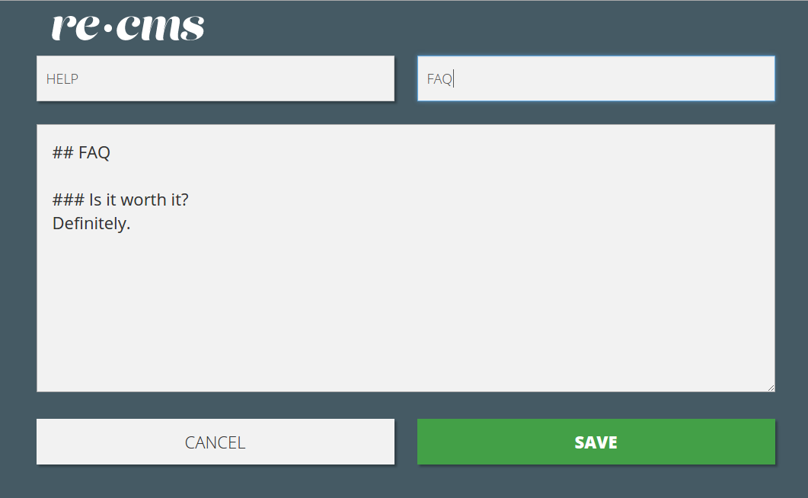

# re-cms



A [re-frame](https://github.com/Day8/re-frame) application designed to edit Markdown content served inside your web application. 
The example [Spring Boot](http://projects.spring.io/spring-boot/) starter backend would be released soon. 

## Development Mode

### Run application:

```
lein clean
lein figwheel dev
```

Figwheel will automatically push cljs changes to the browser.

Wait a bit, then browse to [http://localhost:3449](http://localhost:3449).

## Production Build

```
lein clean
lein cljsbuild once min
```

## Licence

Copyright © 2016 TouK

Distributed under The MIT License (MIT) 
